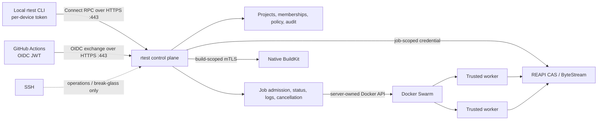

# Architecture

This document describes the implemented shared-service architecture for rtest. The legacy
SSH backends remain migration evidence, not the client contract.
The binding decision and its consequences are recorded in
[ADR 0001](decisions/0001-shared-service-architecture.md).

## Product boundary

rtest moves trusted, resource-heavy commands and Docker image builds away from developer
laptops and GitHub-hosted runners. It is project-aware, but it does not define a project
task language: repositories continue to own commands in Taskfiles, scripts, Makefiles, or
their CI configuration.

The core contract is deliberately small:

- Git semantics select the exact worktree input, including dirty and non-ignored untracked
  files.
- REAPI v2 Merkle trees, CAS, FindMissingBlobs, and ByteStream provide incremental content
  transfer.
- An OCI image defines the command environment; an argument vector, working directory,
  environment, resources, timeout, exit code, stdout, and stderr define execution.
- Dockerfiles and native Buildx/BuildKit define image builds.
- Docker Swarm initially schedules trusted OCI jobs behind the service boundary.
- OpenTelemetry and JUnit are optional standard observability and test-result formats.

There are no language-specific runner types, generated preparation hooks, or required
`.rtest.json` suite definitions in the target contract. A Dev Container adapter can be
added later if real consumers need it, but the Dev Container specification is not a CI
or remote-execution dependency.

## Service topology

The public control plane is a protobuf-defined API served with Connect over HTTPS. It owns
authentication, authorization, projects, admission, job identity, status, logs,
cancellation, scheduling decisions, credential issuance, and audit records. Clients never
receive Docker or Swarm credentials and never address a worker directly.

The data planes remain upstream protocols:

- CAS and ByteStream accept a short-lived, job-scoped mTLS identity.
- BuildKit accepts a short-lived, build-scoped client certificate. The CLI creates an
  ephemeral standard Buildx remote-driver record using `cacert`, `cert`, `key`, and
  `servername`, invokes Buildx unchanged, then removes the record.
- Swarm node certificates identify workers independently from users. Only the control
  plane can reach the Swarm manager API.

## Authentication and authorization

### Local clients

Each laptop receives its own named, revocable, opaque token for one user. Tokens may have
an expiry and are stored server-side only as a keyed digest. Compromise of one laptop does
not require rotating every user or CI credential.

Credential resolution is deterministic:

1. `--token`, for explicit automation and diagnostics;
2. `RTEST_TOKEN`;
3. the operating-system credential store populated by `rtest login`;
4. GitHub OIDC exchange when the Actions identity variables are present.

A static token may authenticate a person to the control plane. It is never forwarded to
CAS, BuildKit, Docker, Swarm, or a worker.

### GitHub Actions

GitHub Actions presents its OIDC JWT to an rtest exchange endpoint with an exact rtest
audience. The control plane validates the issuer, signature through GitHub's JWKS, audience,
expiry, not-before time, and an enabled project trust relationship.

Authorization uses immutable `repository_id` and `repository_owner_id` claims, plus the
configured workflow, ref, environment, and event policy. Repository names are metadata,
not identity. A successful exchange returns a short-lived project credential bounded to
the workflow job. Trusted pull requests use a protected environment or an explicit policy
gate; public forks are denied.

### Jobs and builds

After authorization, the control plane returns a stable job or build ID and only the
short-lived credentials needed for that operation. Job credentials are project- and
operation-scoped, expire quickly, and cannot create other jobs. Logs, status, cancellation,
and artifacts are authorized again by project rather than possession of a Docker identity.

The initial identity model has only four credential classes: user device tokens, GitHub
project trust relationships, job/build credentials, and worker identities. Organization
tokens, general service accounts, browser device flows, and complex roles are deferred
until a demonstrated consumer requires them.

The current protocol-transparent CAS gateway validates that the certificate names an
active job, but bazel-remote still uses one shared CAS namespace. It does not inspect
individual REAPI methods or enforce a project namespace within that active connection.
Because CAS digests are capabilities, this is acceptable only for the current mutually
trusted POC projects. Before onboarding projects that require confidentiality from each
other, add a gRPC-aware method/root authorizer or isolated per-project CAS namespaces.

## Execution flow

1. The CLI resolves the Git root and project identity, then selects tracked and
   non-ignored untracked files with Git.
2. It asks the control plane to admit an arbitrary argument-vector command with an OCI
   image, resources, timeout, and input-root metadata.
3. The CLI uses its job-scoped credential to query CAS and upload only missing blobs.
4. The control plane creates a Swarm replicated job. The scheduler and Docker API remain
   private implementation details.
5. The worker materializes the CAS tree at an identical host/container path and executes
   the command directly in the project-selected, digest-pinned OCI image.
6. The control plane exposes reconnectable status and logs. Cancellation scales the job
   to zero; timeout terminates the process group and returns exit code 124.

The server associates CAS roots, jobs, builds, logs, and audit events with a project.
Project identity replaces a managed server-side Git clone: CAS already provides
content-addressed incremental synchronization without clone drift or patch semantics.

## Testcontainers contract

Trusted test jobs may mount the worker Docker socket. The workspace is mounted at the same
absolute path on the host and inside the runner so sibling Testcontainers can bind project
files. Published ports are reachable from the runner, and Ryuk remains enabled for cleanup.

Docker access is root-equivalent host control, not an isolation boundary. The service only
accepts trusted repositories and trusted pull requests. Running untrusted code requires a
VM or equivalent strong sandbox per job and is a future architecture decision.

## Capacity and portability

CPU and memory reservations equal hard limits. When a worker lacks capacity, a job remains
queued instead of causing host-level memory pressure. The initial CPX32 therefore favors
one predictable heavy job; larger or additional workers increase parallelism without a
client change.

The portable boundaries are Linux, Git, OCI, REAPI CAS/ByteStream, Dockerfiles,
Buildx/BuildKit, and HTTPS. Docker Swarm and the initial CAS implementation are replaceable
server internals. Hetzner is the current host, not a product dependency, and Terraform
remains the provisioning source of truth for dedicated infrastructure.

## Legacy migration boundary

The service implements the accepted target while legacy backends remain available for
migration:

| Current POC | Accepted target |
| --- | --- |
| SSH/Tailscale authenticates every client | HTTPS control plane with device tokens or GitHub OIDC |
| CLI talks directly to Docker Swarm | Control plane owns Docker and scheduling |
| SSH tunnels expose CAS and BuildKit | Job-scoped CAS credentials and build-scoped BuildKit mTLS |
| One shared legacy server token | Separate user, CI, job/build, and worker identities |
| Pinned `standard` Go runner | Project-selected, digest-pinned OCI image |
| `.rtest.json` defines named suites | Existing project tooling supplies arbitrary commands |

No new product feature should deepen the SSH backend, direct client-to-Docker access, the
legacy shared-token coordinator, or language-specific runner/profile abstractions.
