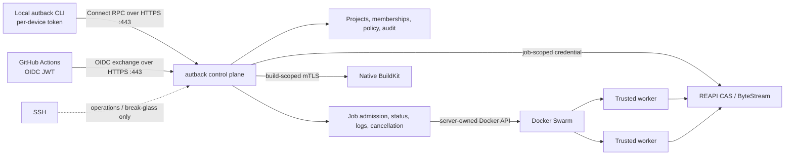

# Architecture

This document describes the implemented shared-service architecture for autback.
The binding decision and its consequences are recorded in
[ADR 0001](decisions/0001-shared-service-architecture.md).

## Product boundary

autback moves trusted, resource-heavy commands and Docker image builds away from developer
laptops and GitHub-hosted runners. It is project-aware, but it does not define a project
task language: repositories continue to own commands in Taskfiles, scripts, Makefiles, or
their CI configuration.

The core contract is deliberately small:

- Git semantics select the exact worktree input, including dirty and non-ignored untracked
  files.
- REAPI v2 Merkle trees, CAS, FindMissingBlobs, and ByteStream provide incremental content
  transfer.
- An OCI image defines the command environment; an argument vector, working directory,
  environment, timeout, exit code, stdout, and stderr define execution.
- Dockerfiles and native Buildx/BuildKit define image builds.
- Docker Swarm initially schedules trusted OCI jobs behind the service boundary.
- OpenTelemetry and JUnit are optional standard observability and test-result formats.

There are no language-specific runner types, generated preparation hooks, or
`.autback.json` suite definitions. A Dev Container adapter can be
added later if real consumers need it, but the Dev Container specification is not a CI
or remote-execution dependency.

Repository identity uses one deliberately small, non-secret `autback.json` containing only
the autback project slug. The CLI resolves an explicit flag, `AUTBACK_PROJECT`, or the nearest
link between the working directory and Git root, in that order. This supports nested
monorepos without turning the file into a task or environment specification.

## Service topology

The public control plane is a protobuf-defined API served with Connect over HTTPS. It owns
authentication, authorization, projects, admission, job identity, status, logs,
cancellation, scheduling decisions, credential issuance, and audit records. Clients never
receive Docker or Swarm credentials and never address a worker directly.
The stable v1 compatibility, idempotency, pagination, error, and reconnectable-log
semantics are specified in [Control API v1](control-api.md).

The data planes remain upstream protocols:

- CAS and ByteStream accept a short-lived, job-scoped mTLS identity.
- BuildKit accepts a short-lived, build-scoped client certificate. The CLI creates an
  ephemeral standard Buildx remote-driver record using `cacert`, `cert`, `key`, and
  `servername`, invokes Buildx unchanged, then removes the record.
- Swarm node certificates identify workers independently from users. Only the control
  plane can reach the Swarm manager API.

### Process lifecycle

The control plane binds the HTTPS, CAS proxy, and BuildKit proxy listeners before it starts
any serving or background component. A bind failure therefore aborts startup before
`/readyz` can be advertised. Metrics collection, reconciliation, capacity maintenance,
FIFO dispatch, both mTLS proxies, and the HTTP server then run under one process context.

SIGTERM, SIGINT, or the first unexpected component exit starts the same bounded drain:
readiness becomes unavailable, the dispatcher rejects new admission, and every component
receives cancellation. Listeners stop in reverse startup order, admission and durable
cleanup goroutines are joined, and SQLite closes only after every component has returned.
Normal cancellation is not an operational error. Swarm jobs are intentionally detached
from this process context; they continue running and the reconciler converges their state
after restart.

## Authentication and authorization

### Local clients

Each laptop receives its own named, revocable, opaque token for one user. Tokens may have
an expiry and are stored server-side only as a keyed digest. Compromise of one laptop does
not require rotating every user or CI credential.

An administrator binds an Autback user to GitHub's immutable numeric account ID.
`autback login` begins a short-lived OAuth authorization-code flow with PKCE and opens the
Autback device approval page. GitHub proves the person; Autback performs membership and
role authorization. After approval, the CLI exchanges its one-time device code exactly
once for an ordinary per-device token and stores that token in the operating-system
credential store. The GitHub access token is never returned to the CLI or retained as an
Autback credential. GitHub username changes do not change identity.

The original high-entropy enrollment code remains a break-glass recovery mechanism. It
expires within 30 minutes, locks after five failed attempts, and is accepted only by
`autback login --recovery-code`. It is not the normal onboarding path.

Credential resolution is deterministic:

1. `--token`, for explicit automation and diagnostics;
2. `AUTBACK_TOKEN`;
3. the operating-system credential store populated by `autback login`;
4. GitHub OIDC exchange when the Actions identity variables are present.

A device token may authenticate a person to the control plane. It is never forwarded to
CAS, BuildKit, Docker, Swarm, or a worker.

### Browser console

The public console uses the same immutable GitHub identity mapping but creates a separate
short-lived Autback browser session. Its Secure, HttpOnly cookie authorizes only server-
rendered `/app` documents and live update streams; browser code never receives a device
token and never calls the Connect control API. Signing out revokes the stored browser
session. Every execution and governance mutation remains a CLI command.

### GitHub Actions

GitHub Actions presents its OIDC JWT to an autback exchange endpoint with an exact autback
audience. The control plane validates the issuer, signature through GitHub's JWKS, audience,
expiry, not-before time, and an enabled project trust relationship.

Authorization uses immutable `repository_id` and `repository_owner_id` claims, plus the
configured workflow, ref, environment, and event policy. Repository names are metadata,
not identity. A successful exchange returns a short-lived project credential bounded to
the workflow job. A `pull_request` trust must name a protected GitHub environment because
the OIDC JWT does not contain an immutable head-repository ID. Environment approval is the
explicit trust gate; unapproved forks and other untrusted PRs never receive an autback
project session.

### Jobs and builds

After authorization, the control plane returns a stable job or build ID and only the
short-lived credentials needed for that operation. Job credentials are project- and
operation-scoped, expire quickly, and cannot create other jobs. Logs, status, cancellation,
and artifacts are authorized again by project rather than possession of a Docker identity.

The identity model has five credential classes: user device tokens, short-lived browser
sessions, GitHub Actions project sessions, job/build credentials, and worker identities.
GitHub human identities and Actions trust policies are authorization relationships, not
credentials. Organization tokens, general service accounts, and complex roles remain
deferred until a demonstrated consumer requires them.

The current protocol-transparent CAS gateway validates that the certificate names an
active job, but bazel-remote still uses one shared CAS namespace. It does not inspect
individual REAPI methods or enforce a project namespace within that active connection.
Because CAS digests are capabilities, this is acceptable only for the current mutually
trusted POC projects. Before onboarding projects that require confidentiality from each
other, add a gRPC-aware method/root authorizer or isolated per-project CAS namespaces.
The shared-cache contract is exercised with two independently authorized projects: the
second project transfers zero already-present CAS bytes and reuses a BuildKit layer while
retaining separate control-plane job/build records.

## Execution flow

1. The CLI resolves the Git root and project identity, then selects tracked and
   non-ignored untracked files with Git.
2. It asks the control plane to admit an arbitrary argument-vector command. The control
   plane resolves the project-owned active OCI digest unless an allowed explicit override
   was supplied, then records that immutable digest with resources and timeout.
3. The CLI uses its job-scoped credential to query CAS and upload only missing blobs.
4. The control plane creates a Swarm replicated job. The scheduler and Docker API remain
   private implementation details.
5. The worker materializes the CAS tree at an identical host/container path and executes
   the command directly in the project-selected, digest-pinned OCI image.
6. The control plane exposes reconnectable status and logs. Cancellation scales the job
   to zero; timeout terminates the process group and returns exit code 124.

Project runner images follow an intentionally small OCI lifecycle. A normal Dockerfile is
built and pushed through native Buildx/BuildKit; Buildx reports the manifest digest; the
control plane pulls and validates that digest before atomically activating it. The previous
digest remains available for rollback, and activation/rollback history is project-scoped.
Runner images contain toolchains and system dependencies, while worktree source continues
to arrive through CAS and writable dependency caches remain explicit worker state.

The server associates CAS roots, jobs, builds, logs, and audit events with a project.
Project identity replaces a managed server-side Git clone: CAS already provides
content-addressed incremental synchronization without clone drift or patch semantics.

## Testcontainers contract

Trusted test jobs may mount the worker Docker socket. The workspace is mounted at the same
absolute path on the host and inside the runner so sibling Testcontainers can bind project
files. Published ports are reachable from the runner, and Ryuk remains enabled for cleanup.

Before each operation can create a runtime, Autback persists an inventory of unprotected
Docker services, containers, networks, and volumes. Because the worker admits only one operation,
every unprotected resource added after that baseline belongs to the operation. Terminal
cleanup gives Ryuk a short grace period, then removes the difference in reverse dependency
order (services, containers, networks, volumes) and verifies that none remain before releasing FIFO.
The immutable baseline and cleanup state survive control-plane or Docker restarts. Swarm
task containers and explicitly `autback.managed=true` infrastructure are excluded; images
and BuildKit records remain governed by capacity/LRU policy rather than per-job deletion.

Docker access is root-equivalent host control, not an isolation boundary. The service only
accepts trusted repositories and trusted pull requests. Running untrusted code requires a
VM or equivalent strong sandbox per job and is a future architecture decision.

## Capacity and portability

Builds and commands share one SQLite-backed FIFO. Submission order is represented by a
monotonic database sequence, and exactly one row may hold the active worker lease. The
dispatcher admits the oldest queued operation and makes no priority, fairness, or resource
estimates. An admitted operation moves through `queued`, `admitting`, `active`,
`terminalizing`, `cleaning`, and `released`. Terminal results can be returned immediately,
but terminalizing and cleaning continue to own the worker reservation so the next FIFO
entry cannot overlap teardown. Cleanup attempts and the last error are durable; an
idempotent cleanup resumes after a control-plane restart. Queue and lease state survive a
control-plane restart.
Active job-preparation and build leases have configurable two-minute safety timeouts.
Released clients renew them while waiting, uploading source, and while Buildx is running,
so a killed or disconnected client cannot block every later operation indefinitely. Job
and build admission require corresponding client capabilities and fail before creating a
record when an older CLI cannot maintain the required lease.

The admitted operation receives the VM's available CPU and memory: Autback does not set
per-job Swarm reservations or limits, and BuildKit is not capped separately. A repository
that wants parallel work submits one command whose own Taskfile, Makefile, test runner, or
script runs tasks concurrently. This keeps project orchestration in the repository while
preventing unrelated dispatchers from oversubscribing the trusted single worker.

The initial deployment has one worker and therefore one active operation. A future worker
pool can assign the oldest queued operation to the next free worker without changing the
client contract or adding per-user scheduling controls.

The portable boundaries are Linux, Git, OCI, REAPI CAS/ByteStream, Dockerfiles,
Buildx/BuildKit, and HTTPS. Docker Swarm and the initial CAS implementation are replaceable
server internals. Hetzner is the current host, not a product dependency, and Terraform
remains the provisioning source of truth for dedicated infrastructure.

Server-owned Docker resource inventory and removal use the typed Moby Engine client with
API-version negotiation rather than parsing Docker CLI output. The adapter keeps SDK types
behind `internal/adapter/docker`; operation cleanup consumes only its narrow resource port.
Compatibility tests exercise both the oldest and newest API versions supported by the
pinned client. Native Buildx remains the intentional client-facing image-build boundary.

## Deliberately absent client paths

The CLI has one transport and execution contract: Connect/HTTPS to the shared service.
It has no direct Docker, Swarm, REAPI, CAS, BuildKit, worker, or SSH backend; those are
private server implementation details. It also has no shared bearer-token coordinator,
named suite/profile format, standard language runner, or source-build installation path.
SSH remains only in host deployment and break-glass operations.
